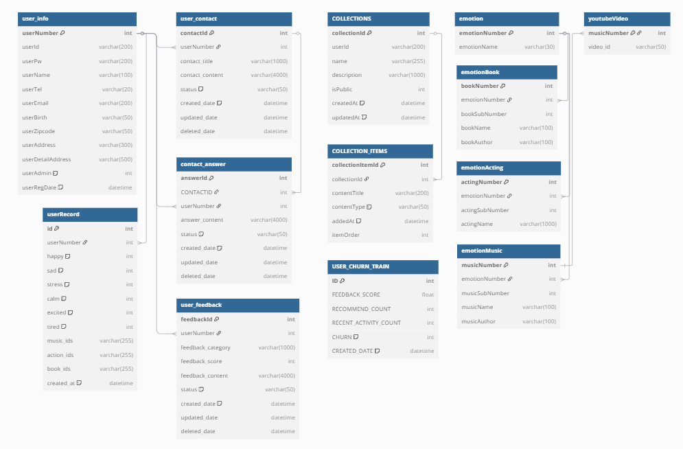
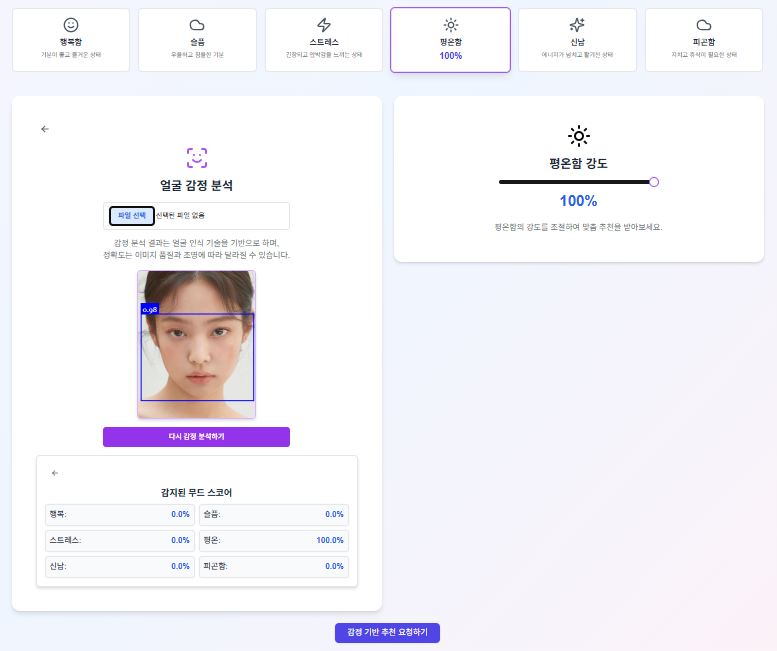
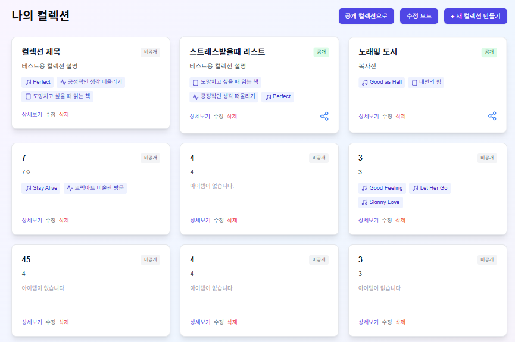
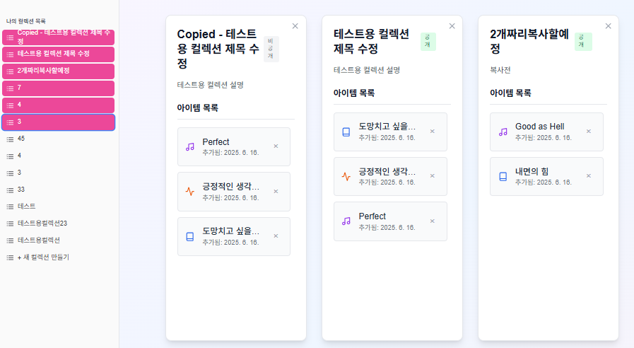

# MoodSync

MoodSync는 사용자의 감정을 파악하고 그에 맞는 음악, 책, 활동을 추천하는 사이트입니다.

**Spring Boot,Next.js 기반 빅데이터 프로젝트**
빅데이터 기반(파이썬·자바·웹) 엘라스틱 검색엔진 개발자과정 `2025. 01. 15 ~ 2025. 07. 14`

<br>

4조 5차 프로젝트 진행 기간 `2025. 05. 27 ~ 2025. 06. 16`

## 💡 프로젝트 선정 배경

* MoodSync는 현대인의 복잡하고 다양한 감정을 이해하고, 이에 기반한 맞춤형 활동을 제안하여 삶의 질을 향상시키는 것을 목표로 제작
* 단순히 감정을 기록하는 것을 넘어, 사용자의 현재 감정과 가용 시간을 고려하여 실질적인 도움을 줄 수 있는 구체적인 추천을 제공함으로써, 정서적 웰빙 증진에 기여
* 최신 웹 트렌드에 맞는 Next.js 프레임워크 사용으로 **React 기반 SPA와 MPA의 장점**활용
* Spring Boot 백엔드, REST API 연동(JSON 표현,MVC패턴 아키텍처)

---
## 🛠️ 설계

### DB diagram을 사용한 erd 테이블 설계


### 사용 기술 스택

- **Frontend**
  - React
  - Next.js
  - TypeScript
  - Tailwind CSS
- **Backend**
  - Spring Boot (REST API)
  - Java 17+
  - MyBatis 
  - Gradle 
  - Tenserflow
  - JWT token
  - Spring security
- **Database & Infra**
  - Oracle
  - SMTP
  - Youtube rss connect
- **기타**
  - Sourcetree
  - GitHub 
  - Slack
  - Notion 

## 🛠️ 담당 기능 제작

### Next.js - Node.js 
- 프로젝트를 새롭게 진행하면서 Next.js를 도입하면서 React의 전반 뼈대 구성을 담당.
- Next.js / Typescript 구조파악, 코드리뷰 및 미팅 진행
- MPA(SSR,SSG)Route 등의 특성 파악에 집중
- CORS 대비 설정 
- REST API 연동방식 스터딩 진행 
- 라우트 엔트리 포인트 기존을 컴포넌트/레이아웃화 진행 

### 📁 컴포넌트화 완료된 Next.js Dir 구조

```
front-end
├── .next
│   ├── cache
│   ├── server
│   ├── static
│   └── types
├── app
│   ├── admin
│   ├── collections
│   ├── user
│   ├── settings
│   └──  ...(페이지별 구분)
├── components
│   ├── admin
│   ├── Collection
│   └──  ...(기능별 구분)
├── hooks
│   └── emotionMapper
├── lib
│   ├── api
│   │   ├── base.ts
│   │   ├── auth.ts
│   │   ├── collections.ts
│   │   └──  ...(기능별 구분)
│   ├── mypage
│   └── animations
├── node_modules
├── public
│   └── models
├── store
│   └── authStore.ts
├── styles
├── types
│   ├── collection.ts
│   └── emotion.ts
├── .gitignore
├── components.json
├── next-env.d.ts
├── next.config.mjs
├── package.json
├── tailwind.config.ts
├── test.py
└── tsconfig.json

```

### Face-api 적용방식

<table>
  <tr>
    <td align="center">face-api</td>
    <td align="center">사용예제</td>
  </tr>
  <tr>
    <td></td>
    <td></td>
  </tr>
</table>

- [face-api Github Link](https://github.com/justadudewhohacks/face-api.js)에서 지원하는 7개의 감정(happy,sad,neutral,surprised,angry,gearful,disgursting)값을  MoodSync에서 사용하는 감정 6개(행복,슬픔,평온,신남,스트레스,피곤함)로 매핑 시도
- 감정을 전송하고, 그 값을 슬라이더로 조절해 tensorflow로 전송

```Typescript
// hooks/emotionMapper.ts

import { FaceExpressions, CustomMoodScores } from '@/types/emotion';

/**
 * face-api.js의 기본 감정을 사용자 정의 감정 스코어(0-100%)로 매핑
 *
 * @param expressions face-api.js에서 감지된 얼굴 감정 표현 객체
 * @returns 사용자 정의 감정 스코어 객체 (0-100%)
 */

export function mapEmotionsToMoodSync(expressions: FaceExpressions): CustomMoodScores {
  const { neutral, happy, sad, angry, fearful, disgusted, surprised } = expressions;

  const moodScores: CustomMoodScores = {
    행복: 0,
    슬픔: 0,
    스트레스: 0,
    평온: 0,
    신남: 0,
    피곤함: 0,
  };

  // 각 감정 스코어 계산 (0-100% 범위로 변환)
  // Math.min(100, Math.max(0, value))-> 0-100% 범위로 조정 

  // 1. 행복 : 'happy' 
  moodScores.행복 = Math.min(100, Math.max(0, happy * 100));

  // 2. 슬픔 : 'sad'
  moodScores.슬픔 = Math.min(100, Math.max(0, sad * 100));

  // 3. 스트레스 : 'angry', 'fearful', 'disgusted' 감정의 조합
  moodScores.스트레스 = Math.min(100, Math.max(0, (angry * 0.7 + fearful * 0.2 + disgusted * 0.1) * 100));

  // 4. 신남 : 'happy'와 'surprised' 감정 조합
  moodScores.신남 = Math.min(100, Math.max(0, (happy * 0.6 + surprised * 0.4) * 100));

  // 5. 평온 : 'neutral' 감정이 높고, 다른 강한 감정들이 낮을 때
  const otherEmotionsSum = angry + fearful + disgusted + sad + surprised + happy;
  moodScores.평온 = Math.min(100, Math.max(0, (neutral * 1.5 - otherEmotionsSum * 0.5) * 100));
  // neutral이 높고 다른 감정들이 낮을 때 평온도가 높도록 조정
  // EX: neutral이 0.8이고 다른 모든 감정이 0.05 이하면 (0.8 * 1.5 - 0.05 * 6 * 0.5) * 100 = (1.2 - 0.15) * 100 = 105 -> 100

  // 6. 피곤함 : face-api.js만으로는 정확한 감지가 어려움
  const totalEmotionIntensity = neutral + happy + sad + angry + fearful + disgusted + surprised;
  if (totalEmotionIntensity < 0.5) { // 전체 감정 강도가 낮을 때
    // neutral이 아주 높지 않으면서 전반적으로 감정 표현이 약할 때 피곤함으로 간주
    moodScores.피곤함 = Math.min(100, Math.max(0, (0.5 - totalEmotionIntensity) * 200)); // 0.5 - 0.0 = 0.5 * 200 = 100
  }

  return moodScores;
}
```

### Collection

- 컬렉션 페이지 요건정의 작성

```text
### 1.1. 컬렉션 생성 및 관리

- **~~REQ-001 (컬렉션 생성/수정/삭제): CRUD
    - 컬렉션 공개/비공개 설정 (초기값 비공개)
- **REQ-002 (콘텐츠 추가):** 사용자는 추천받은 콘텐츠(활동, 음악, 도서 등) 또는 직접 검색/탐색한 콘텐츠를 **컬렉션에 추가**
    - 각 콘텐츠 카드/상세 페이지에 '컬렉션에 추가' 버튼 제공
    - 추가 시, 기존 컬렉션 선택 또는 **새 컬렉션 생성** 옵션 제공
- **REQ-003 (콘텐츠 삭제):** 사용자는 컬렉션 내에서 **특정 콘텐츠를 삭제**할 수 있어야 합니다.
- **REQ-004 (컬렉션 수정):** 사용자는 생성한 컬렉션의 **이름, 설명, 공개/비공개 여부 등을 수정**할 수 있어야 합니다.
- **REQ-005 (컬렉션 삭제):** 사용자는 생성한 **컬렉션 전체를 삭제**할 수 있어야 합니다. (삭제 시 확인 팝업 제공)

### 1.2. 컬렉션 조회 및 탐색

- **REQ-006 (마이페이지 연동):** 마이페이지 내에 '나의 컬렉션' 또는 '큐레이션' 섹션을 추가하여 사용자가 생성한 모든 컬렉션을 한눈에 볼 수 있어야 합니다.
- **REQ-007 (컬렉션 상세 조회):** 각 컬렉션을 클릭하면 해당 컬렉션에 포함된 모든 콘텐츠 목록과 상세 정보를 확인할 수 있어야 합니다.
- **REQ-008 (콘텐츠 상세 연결):** 컬렉션 내 콘텐츠 클릭 시 해당 콘텐츠의 원래 상세 페이지(예: 유튜브 링크, 도서 정보 페이지)로 이동해야 합니다.

### 1.3. 컬렉션 공유 기능

- **REQ-009 (공개 컬렉션 공유):** 사용자는 '공개'로 설정된 자신의 컬렉션을 **고유 링크를 통해 공유**할 수 있어야 합니다.
    - 링크 복사 버튼 제공
    - (선택) 소셜 미디어 직접 공유 버튼 (카카오톡, 페이스북 등)
- **REQ-010 (공유 컬렉션 조회):** 공유 링크를 통해 접속한 사용자(비회원 포함)는 해당 컬렉션의 콘텐츠 목록을 볼 수 있어야 합니다.

```
<hr>
<table>
  <tr>
    <td align="center">나의 Collection 페이지</td>
    <td align="center">Collection 수정 페이지</td>
  </tr>
  <tr>
    <td></td>
    <td></td>
  </tr>
</table>

- CRUD 
- 노션과 유사한 리스트 재정렬 기능 고안
- npm install @hello-pangea/dnd 활용한 [드래그 드랍 기능](https://dnwndus.tistory.com/entry/React-react-beautiful-dnd-%EB%93%9C%EB%9E%98%EA%B7%B8-%EB%93%9C%EB%9E%8D-%EB%9D%BC%EC%9D%B4%EB%B8%8C%EB%9F%AC%EB%A6%AC)

<hr>

<table>
  <tr>
    <td align="center">나의 Collection/CRUD</td>
    <td align="center">Collection 수정/CRUD</td>
  </tr>
  <tr>
    <td></td>
    <td></td>
  </tr>
</table>


## 🔗 관련 링크
<!-- 
  * [[Render 배포링크](https://recall-final-front.onrender.com/)]
    * 서버 불안정으로 동작 안될 수 있음
    * 리콜통계 부분은 render 서버로 호환x  -->
  * **GitHub Repository:** 
    * [[우주연-GitHub Repository URL](https://github.com/Wjyuy)]

  * **발표자료** 

  * <a href="./lib/files/MoodSync_1차ppt.pdf" download="document.pdf">1차발표 PDF 미리보기</a>
  * <a href="./lib/files/MoodSync_2차ppt.pdf" download="document.pdf">2차발표 PDF 미리보기</a>

  * **시연영상 보기**
<!-- 
  [](https://www.youtube.com/watch?v=cTVAbfrtdEs) -->
